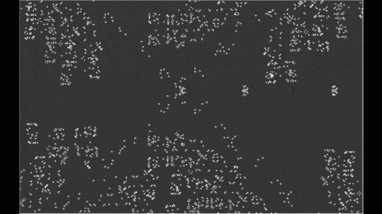

# Sistema de Simulação de Ecossistema/Jogo da Vida Multi-Espécies

Sistema de simulação de um ecossistema baseado no modelo de **Autômato Celular**, e desenvolvido em C++ para a disciplina de **Programação Orientada a Objetos (POO)**.

O código foi inspirado no **Jogo da Vida de John Conway** (*John Conway's Game of Life*), no entanto, serão abordados diferentes seres vivos e como eles interagem entre si num ambiente determinístico.

O projeto permite criar, carregar, editar e simular um ambiente composto por diferentes tipos de células, observando suas interações e evolução ao longo de uma quantidade X de ciclos.

# Sumário

- [Sobre o Sistema](##-sobre-o-sistema)
- [Funcionalidades](##️-funcionalidades)
- [Objetivo](##-objetivo)
- [Arquitetura](##-arquitetura)
- [Estrutura da Simulação](##-estrutura-da-simulação)
- [Arquivos de Entrada](#️#-arquivos-de-entrada)
- [Tecnologias](##-tecnologias)
- [Sobre o Grupo](##-sobre-o-grupo)

## Sobre o Sistema

O ambiente irá conter um grid, em que os principais tipos de células serão:

| **Classe** | **Descrição** |
|---|---|
| **Planta** | Cresce, envelhece e pode ser consumida por herbívoros. |
| **Herbívoro** | Procura plantas para se alimentar, possui condições de fome e pode se reproduzir. |
| **Predador** | Procura herbívoros para se alimentar, possui condições de fome e pode se reproduzir. |
| **Parede** | Funciona como um obstáculo estático e impede a ocupação daquela posição. |

A simulação acontece em ciclos, nos quais as células atualizam seus estados de acordo com as regras definidas para o ecossistema.

## Funcionalidades

- Carregamento de um ecossistema a partir de arquivo de texto.
- Validação dos caracteres utilizados no arquivo.
- Criação e edição manual do ambiente.
- Inserção de plantas, herbívoros, predadores e paredes.
- Execução da simulação por ciclos.
- Avanço de um ou vários ciclos.
- Pausar e retomar a simulação.
- Visualização do estado atual do ecossistema.
- Exibição de legenda dos elementos.
- Salvamento e carregamento do estado da simulação.
- Execução de vários ciclos sem atualização da interface.

## Objetivo

O projeto tem como objetivo aplicar, em um sistema de simulação, conceitos de:

- Classes e objetos
- Encapsulamento
- Herança
- Polimorfismo
- Relacionamento entre classes
- Gerenciamento de memória
- Manipulação de arquivos
- Organização e modularização de código

## Arquitetura

                         Celula
                            │
          ┌───────────┬─────┴───────┬───────────────┐
          │           │             │               │
       Planta       Parede      Herbivoro       Carnivoro

      Grid              ControladorSimulacao
       ├── Celula       GerenciadorArquivo
       └── Posicao      Gui
       

##  Estrutura da simulação

A cada ciclo, o estado do ecossistema é atualizado de acordo com as regras definidas para cada tipo de célula.

## Arquivos de entrada

O ambiente pode ser definido através de um arquivo de texto contendo a representação do grid.

Exemplo:

.......... 
..H....... 
....P..... 
......#... 
..P....C.. 
..........

## Tecnologias

| **Linguagem** | C++ |
| **Interface Gráfica** | Biblioteca SFML |
| **Manipulação de Arquivos** | Biblioteca fstream |

## Sobre o Grupo
| **Nome** | **Matrícula** |
|---|---|
| Alice Santos Faria | 117261 |
| Dylan Adriel Lopes Rosales | 124676 |
| Hyara Richielli Morais | 124697 |
| Rayssa de Castro Vieira | 124664 |
| Thiago Luis de Arruda Rodrigues | 124678 |

